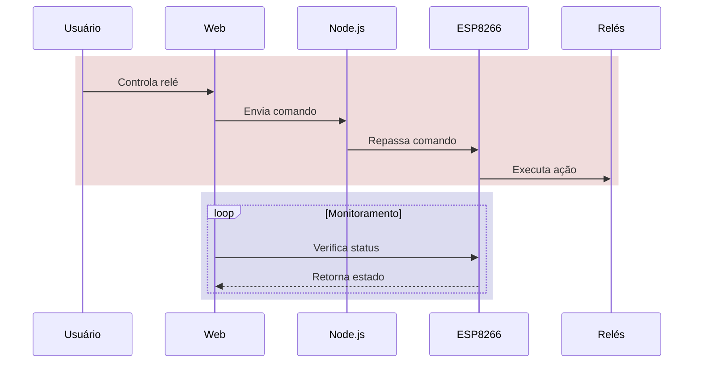
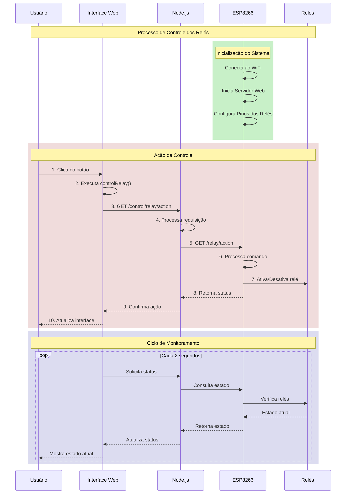

# Documentação do Sistema de Controle de Relés

## Visão Geral do Sistema
Sistema de controle remoto de relés utilizando ESP8266, Node.js e interface web.

## Diagrama Resumido

## Diagrama Detalhado do Sistema

## Explicação do Fluxo

### 1. Inicialização (Verde):
- ESP8266 inicia e conecta à rede WiFi
- Configura os pinos dos relés
- Inicia o servidor web interno

### 2. Controle dos Relés (Vermelho):
1. Usuário clica no botão na interface web
2. JavaScript executa função de controle
3. Requisição enviada ao servidor Node.js
4. Node.js processa e encaminha para ESP8266
5. ESP8266 recebe e executa o comando
6. Relé é ativado/desativado
7. Confirmação retorna pela mesma rota
8. Interface atualiza para mostrar novo estado

### 3. Monitoramento Contínuo (Azul):
- Interface web verifica status a cada 2 segundos
- Requisição passa pelo Node.js até o ESP8266
- ESP8266 retorna estado atual dos relés
- Interface atualiza para mostrar estado real

## Componentes do Sistema

### Interface Web
- HTML/JavaScript para controle
- Botões para cada relé
- Atualização automática de status

### Servidor Node.js
- Intermediário entre interface e ESP8266
- Processa requisições
- Gerencia comunicação

### ESP8266
- Conectado aos relés físicos
- Servidor web embarcado
- Executa comandos de controle

### Relés
- Componentes físicos
- Controlados por sinais do ESP8266
- Estados: Ligado/Desligado