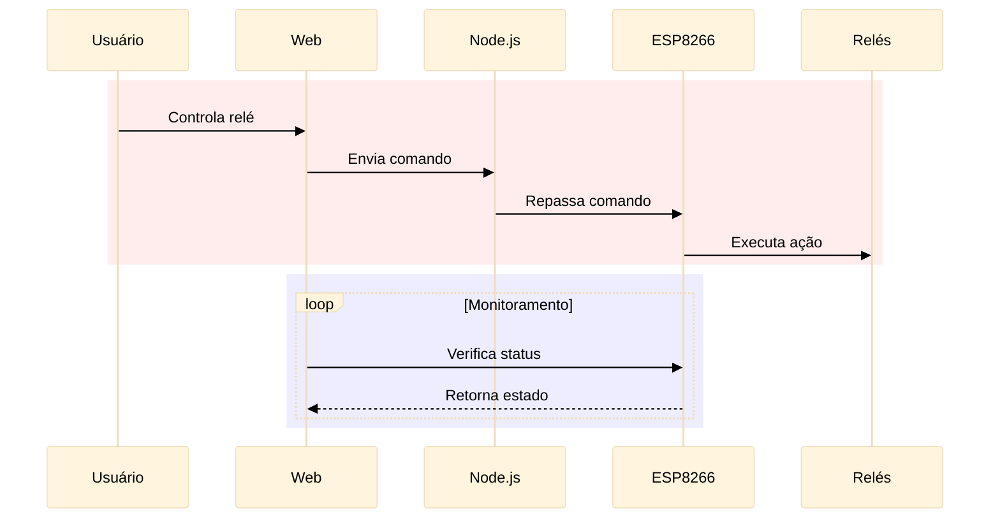
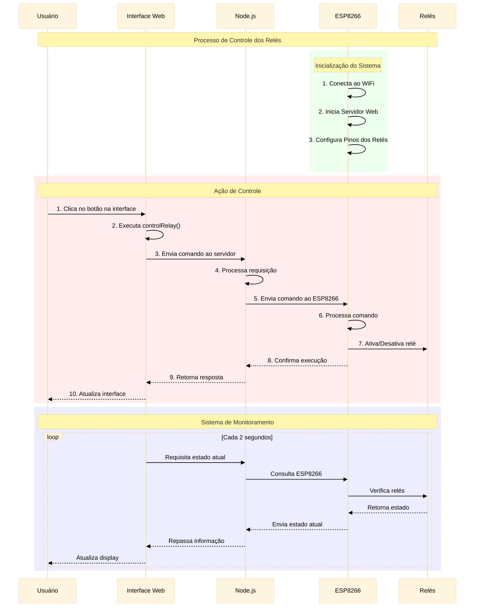

# Documentação do Sistema de Controle de Relés

## Visão Geral do Sistema
Sistema de controle remoto de relés utilizando ESP8266, Node.js e interface web.

## Diagrama Resumido

## Diagrama Detalhado do Sistema

## Explicação do Fluxo

### 1. Inicialização (Verde):
- ESP8266 inicia e conecta à rede WiFi configurada
- Configura pinos digitais para controle dos relés
- Inicia servidor web interno para receber comandos

### 2. Controle dos Relés (Vermelho):
1. Usuário interage com botão na interface web
2. JavaScript processa a ação do usuário
3. Envia comando HTTP para servidor Node.js
4. Servidor Node.js valida e processa a requisição
5. Comando é enviado ao ESP8266
6. ESP8266 processa o comando recebido
7. Sinal digital é enviado ao relé
8. Confirmação retorna por toda a cadeia
9. Interface atualiza para mostrar novo estado

### 3. Monitoramento Contínuo (Azul):
- Interface web mantém verificação periódica
- Requisições de status a cada 2 segundos
- ESP8266 verifica estado físico dos relés
- Estado atual é enviado de volta
- Interface atualiza informações em tempo real

## Componentes do Sistema

### Interface Web
- Frontend em HTML/JavaScript
- Controles intuitivos para cada relé
- Sistema de atualização automática
- Feedback visual do estado dos relés

### Servidor Node.js
- API REST para controle
- Gerenciamento de comunicação
- Tratamento de erros
- Validação de comandos

### ESP8266
- Microcontrolador com WiFi
- Controle direto dos relés
- Servidor web embarcado
- Processamento de comandos em tempo real

### Relés
- Componentes físicos de chaveamento
- Controle via sinais digitais
- Estados binários (Ligado/Desligado)
- Feedback de estado atual